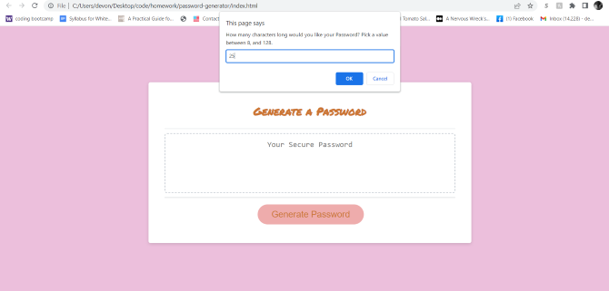
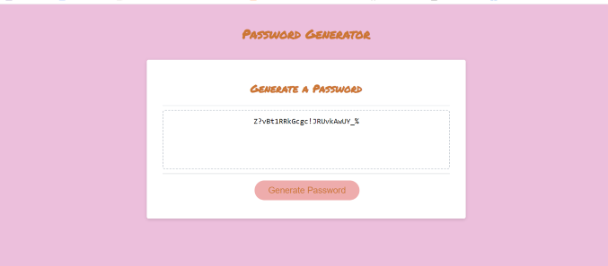

# password-generator

## Objective
The objective of this assignment was two-fold: update pre-existing starter code to create a functioning password generator, and learn part of the Javascript process while creating it. 

## Process
I parsed out the ReadMe file from the assigned 'challenge' to create a roadmap of source for me to follow. I commented out my "roadmap" in the 'js' file which helped me to keep my process coherent and focused, but also allows any web developer (especially new) to go in and understand the flow of my code.

## How it works from the perspective of a user
The password generator uses a 5 part series of questions to return a password meeting the agreed upon criteria. If the user doesn't meet the question criteria, like selecting a value between 8 and 128 for password length, it prompts them respond again within the given framework. 

## Result 
A functioning password generator, give it a try:

## Weblinks 
Deployed website: https://d-dursty.github.io/password-generator/
Github Repository: https://github.com/D-Dursty/password-generator

## Screenshots 

## License
N/A

## Credits
Built with so much frustration, confusion, and moments of understanding with amazing support by my friends, Tutors, and startercode credit to 2u bootcamp, by Devon Durst, September 2022
